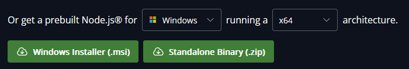
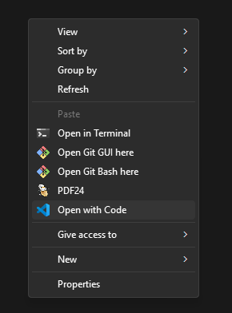
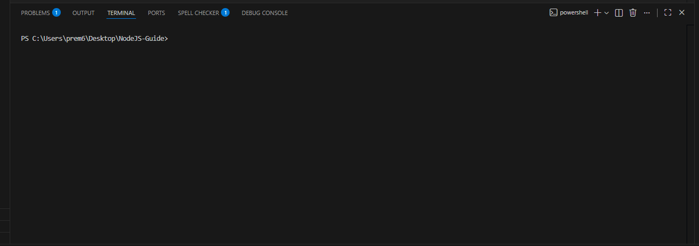

# Work Sheet 0 - Getting Started

Welcome to this starter worksheet - the aim of this is to download the actual stuff we need.

## Task 0.1 - Installation
First, you must download Node.js. You can do this at [https://nodejs.org/en/download](https://nodejs.org/en/download).

At the top, you will see a command to paste in. Ignore that, unless you know what it is on about, and instead, we will focus on the following section:


Here, select your OS, and your architecture. If you are not sure about what architecture you are using, ask Google.

Then, click on the installer. If you are on Windows or Mac, please select the installer instead of the binaries. You should then click the item to run it, and it should install stuff. If you are on Linux, the way you install is a tad bit different, but if you're already using Linux, you should know how to install it.

Once it has done installing, open up your terminal (command prompt or powershell both suffice for Windows), and verify that you have successfully installed it, by entering the command
```
node -v
```
which should return something like
```
v20.11.0
```
(noting this version may differ from the one you have)

and also, we need to ensure `npm` (node package manager) is installed. You can do this by entering the command:
```
npm -v
```
which should return something like
```
10.2.4
```
noting this number (also a version number) will differ. 

It is likely your version numbers are higher than mine. This shouldn't break anything as the core functionality of nodejs should remain the same. If the version numbers are lower, something may break, but this shouldn't be the case.

## Task 0.2 - The IDE
An IDE, for those who don't know, is something that you can write code on, but with some pretty features, like colouring code, telling you if there is something blatantly wrong with your syntax, or indeed has a terminal to help you execute stuff.

Now, although you *could* write code in notepad, I don't recommend it.

I would recommend VS Code as it is quite intuitive - you can download at [https://code.visualstudio.com/](https://code.visualstudio.com/)

## Task 0.3 - Familiarity with VS Code
First, you may want to create a folder for your project.

On Windows at least, when in that folder, you will get the option to open in Code:


If not, you can always open the terminal either in that folder, or opening the terminal and using the `cd` command to navigate to the folder, and then typing in:
```
code .
```
This should open VS Code

A terminal may appear at the bottom like:


If not, go to the top toolbar, press `Terminal`, and then `New Terminal`.